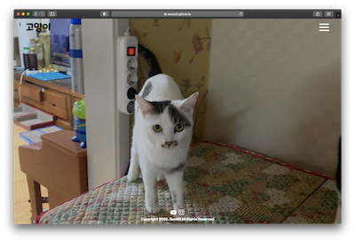
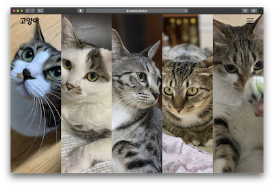
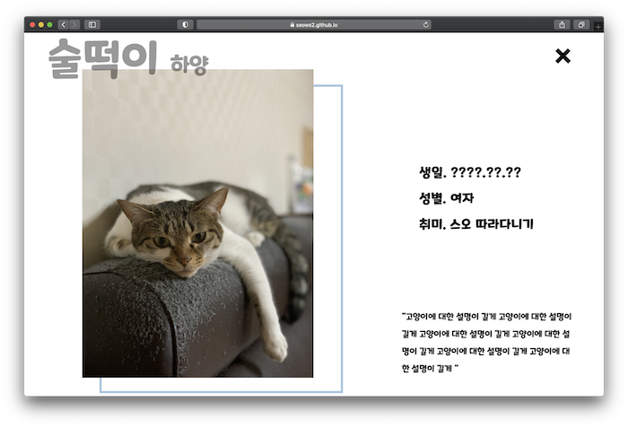
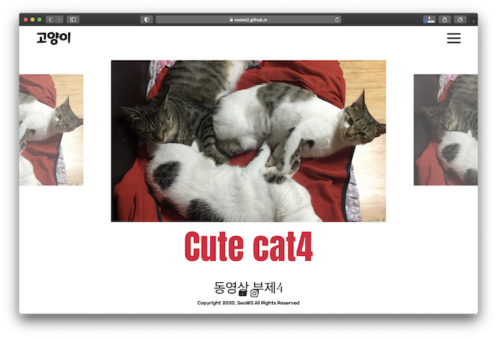

# Cat-Fansite

## 프로젝트 소개

우리 집 고양이 팬사이트를 제작하는 프로젝트로 5마리 고양이의 귀여움을 널리 알리고 아가들의 깜찍함을 말로는 설명할 수 없기에 고양이를 소개할 수 있는 웹페이지를 개발 공부겸 제작하게 되었습니다. 고양이 5마리에 대한 소개와 사진, 앨범을 통해 고양이를 알아갈 수 있는 페이지입니다. [링크](https://seows2.github.io/Cat-Fansite/html/index.html)를 통해 실제 프로젝트를 확인해 볼 수 있습니다.

 

## 웹페이지 소개

|                       홈                       |                      소개                       |
| :--------------------------------------------: | :---------------------------------------------: |
|  |  |

|                       소개 상세                        |                      사진                       |
| :----------------------------------------------------: | :---------------------------------------------: |
|  |  |

|                     비디오                      |
| :---------------------------------------------: |
|  |

 

## 사용해 본 기술 및 프로그램

|                                                                      마크업 언어                                                                       |                                                                     스타일 언어                                                                      |                                           프로그래밍 언어                                            |                                                모듈 번들러                                                |                                              웹 호스팅                                              |
| :----------------------------------------------------------------------------------------------------------------------------------------------------: | :--------------------------------------------------------------------------------------------------------------------------------------------------: | :--------------------------------------------------------------------------------------------------: | :-------------------------------------------------------------------------------------------------------: | :-------------------------------------------------------------------------------------------------: |
|  |  |  |  |  |

 

## Webpack
웹팩을 사용하게 된 이유는 아래의 이유였습니다.

- 여러가지 CSS 속성들에 각각 vendor prefix를 붙여야 하는데 간단한 방법이 없을까?
- JS의 ES6+ 문법들을 Babel로 처리해야 하는데 어떻게 한번에 처리할 수 있을까?
- 각 페이지마다 요청하는 CSS/JS 파일이 많은데 HTTP 요청을 최소화 할수는 없을까?

구글링을 했고, 다양한 방법들이 나왔는데 그 중에서 요즘 제일 많이 쓰이고 통합적인 기능을 제공하는 것이 바로 웹팩이었습니다. 웹팩 설정에 정말 고생을 했고 삽질도 많이 하면서 웹팩에 좀 더 익숙해지게 되었고 필요성이 실제적으로 느껴졌습니다.

 

## 이 프로젝트를 통해 알게 된 것

- HTML 시맨틱 태그와 이를 활용하는 방법
- CSS media쿼리를 활용하여 모바일 화면을 구현하는 법
- 자바스크립트를 통해 HTML구조를 동적으로 변화시키는 것
- 자바스크립트로 클래스 변화를 통해 CSS keyframe 애니메이션을 구현하는 방법
- 이미지 lazy loading, 화면 overlay 기법의 구현
- 크로스브라우징을 위한 webpack 설정법
- 자바스크립트 라이브러리를 사용하고 구현하는 방법 (Masonry, IntersectionObserver, fullpage등등)
- youtube API를 통해 동영상을 제어하는 방법
